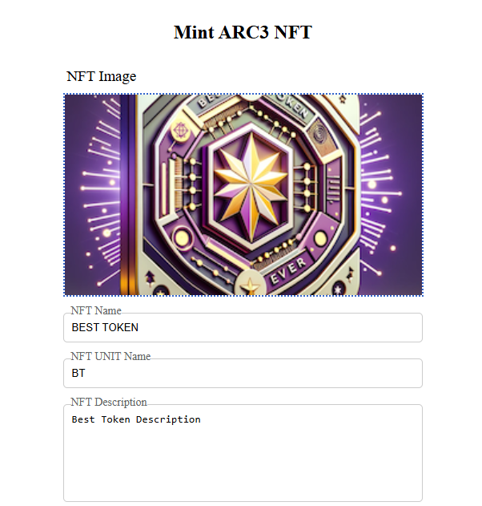
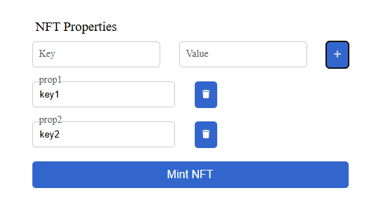
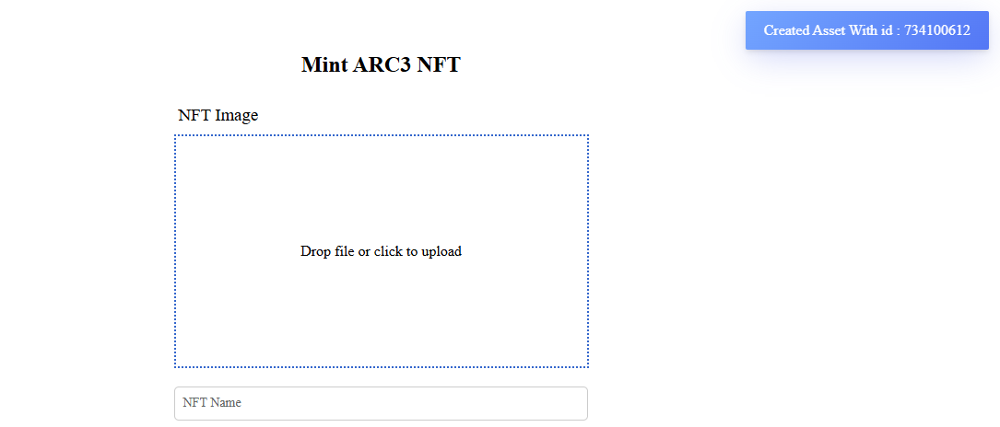

# ARC3 NFT Creation

## Overview

This project is a web application for creating ARC3 NFTs (Non-Fungible Tokens) on the Algorand blockchain. The application allows users to upload an image, provide metadata, and mint an NFT with the provided details. The metadata and image are pinned to IPFS using Pinata, ensuring decentralized storage.

## Features

- **Image Upload**: Users can upload an image for the NFT.
- **Metadata Input**: Users can provide metadata such as NFT name, unit name, description, and properties.
- **IPFS Integration**: The image and metadata are pinned to IPFS using Pinata.
- **Algorand Blockchain**: The NFT is minted on the Algorand blockchain with the provided details.

## Technologies Used

- **Flask**: A lightweight WSGI web application framework in Python.
- **Algorand SDK**: For interacting with the Algorand blockchain.
- **Pinata**: For pinning files to IPFS.
- **HTML/CSS/JavaScript**: For the frontend interface.

## Project Structure

```
/C:/Users/Satish chandra/Projects/task-1
│
├── app.py                  # Main application file
├── templates/
│   └── index.html          # HTML template for the web interface
├── static/
│   ├── toastify.css        # CSS for toast notifications
│   └── toastify.js         # JavaScript for toast notifications
├── .env                    # Environment variables (not included in version control)
├── .env.sample             # Sample environment variables file
└── readme.md               # Project overview and documentation
```

## Getting Started

### Prerequisites

- Python 3.x
- Flask
- Algorand SDK
- Requests library
- Python-dotenv

### Installation

1. Clone the repository:
   ```bash
   git clone https://github.com/your-repo/task-1.git
   cd task-1
   ```

2. Install the required packages:
   ```bash
   pip install flask py-algorand-sdk requests python-dotenv
   ```

3. Create a `.env` file by copying the `.env.sample` file and updating it with your credentials:
   ```bash
   cp .env.sample .env
   ```

4. Run the application:
   ```bash
   python app.py
   ```

5. Open your browser and navigate to `http://127.0.0.1:5000/` to access the application.

## Usage

1. Upload an image for the NFT.

2. Provide the NFT name, unit name, description, and properties.

3. Click "Mint NFT" to create the NFT on the Algorand blockchain.
4. A notification will display the status of the NFT creation.
